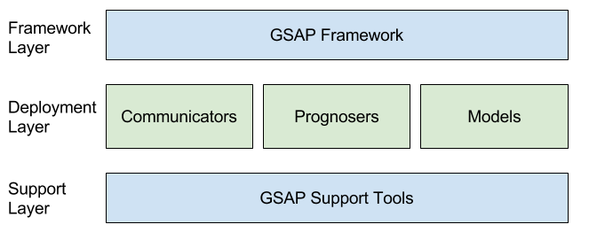

# GSAP

 **[For complete documentation see the wiki
here](https://github.com/nasa/GSAP/wiki)** 

## About
The Generic Software Architecture for Prognostics (GSAP) is a framework for
applying prognostics. It makes applying prognostics easier by implementing many
of the common elements across prognostic applications. The standard interface
enables reuse of prognostic algorithms and models across  using the GSAP
framework.

The GSAP framework is used through the creation of communicators, prognosers, or
models (the deployment layer). The elements of the deployment layer plugs into
the framework and use the tools of the support layer. These elements are
described further below:

* **Communicators**:

  Communicators are used to communicate data with the outside world. These
function as interfaces with various data sources and sinks. Some examples could
be a playback agent that reads from a file, a GUI for displaying prognostic
results, an automated report generator, or a client that connects into a network
messaging system (for example: SCADA). These systems can receive data which will
be used by prognosers or communicate the results with operators.

* **Prognosers**:

  This is the core of the GSAP system. Inside the prognosers is the core logic for performing prognostics. A new prognoser is created to support a new method for performing prognostics. Many prognostics systems follow a common model-based structure. Those systems do not require the creation of a new prognoser, only the creation of a new model that will be used by the modelBasedPrognoser. For more information on this see the section Extending.

* **Models**:

  Models are a method of representing the behavior of a component. A common way of performing prognostics is using a model that describes both the healthy and damaged behavior of the components. The modelBasedPrognoser uses the models to perform prognostics.

Each of these components is configured through the use of configuration files.
This allows for a GSAP deployment to be configured to a new configuration or
system without any software changes.

## Using
[See the Getting Started page for
information](https://github.com/nasa/GSAP/wiki/Getting-Started)

## Extending
GSAP is designed to be easy to extend to fit your use. Extending GSAP is done by
adding Prognosers, Models, Algorithms, or Communicators. When the behavior of the component
being prognosed is represented by a model, users can create a new model and use
the supplied modelBasedPrognoser for prognostics. This is done instead of adding
a new prognoser. [For more information on extending see the wiki
here](https://github.com/nasa/GSAP/wiki)

## Contact
If you have questions, please contact Chris Teubert
(christopher.a.teubert@nasa.gov)

## Contributing
All contributions are welcome! If you are having problems with the plugin, please open an issue on GitHub or email Chris Teubert. If you would like to contribute directly, please feel free to open a pull request against the "develop" branch. Pull requests will be evaluated and integrated into the next official release.

## Notices

Copyright ©2016 United States Government as represented by the Administrator of the National Aeronautics and Space Administration. All Rights Reserved.

No Warranty: THE SUBJECT SOFTWARE IS PROVIDED "AS IS" WITHOUT ANY WARRANTY OF
ANY KIND, EITHER EXPRESSED, IMPLIED, OR STATUTORY, INCLUDING, BUT NOT LIMITED
TO, ANY WARRANTY THAT THE SUBJECT SOFTWARE WILL CONFORM TO SPECIFICATIONS, ANY
IMPLIED WARRANTIES OF MERCHANTABILITY, FITNESS FOR A PARTICULAR PURPOSE, OR
FREEDOM FROM INFRINGEMENT, ANY WARRANTY THAT THE SUBJECT SOFTWARE WILL BE ERROR
FREE, OR ANY WARRANTY THAT DOCUMENTATION, IF PROVIDED, WILL CONFORM TO THE
SUBJECT SOFTWARE. THIS AGREEMENT DOES NOT, IN ANY MANNER, CONSTITUTE AN
ENDORSEMENT BY GOVERNMENT AGENCY OR ANY PRIOR RECIPIENT OF ANY RESULTS,
RESULTING DESIGNS, HARDWARE, SOFTWARE PRODUCTS OR ANY OTHER APPLICATIONS
RESULTING FROM USE OF THE SUBJECT SOFTWARE.  FURTHER, GOVERNMENT AGENCY
DISCLAIMS ALL WARRANTIES AND LIABILITIES REGARDING THIRD-PARTY SOFTWARE, IF
PRESENT IN THE ORIGINAL SOFTWARE, AND DISTRIBUTES IT "AS IS."

Waiver and Indemnity: RECIPIENT AGREES TO WAIVE ANY AND ALL CLAIMS AGAINST THE
UNITED STATES GOVERNMENT, ITS CONTRACTORS AND SUBCONTRACTORS, AS WELL AS ANY
PRIOR RECIPIENT.  IF RECIPIENT'S USE OF THE SUBJECT SOFTWARE RESULTS IN ANY
LIABILITIES, DEMANDS, DAMAGES, EXPENSES OR LOSSES ARISING FROM SUCH USE,
INCLUDING ANY DAMAGES FROM PRODUCTS BASED ON, OR RESULTING FROM, RECIPIENT'S USE
OF THE SUBJECT SOFTWARE, RECIPIENT SHALL INDEMNIFY AND HOLD HARMLESS THE UNITED
STATES GOVERNMENT, ITS CONTRACTORS AND SUBCONTRACTORS, AS WELL AS ANY PRIOR
RECIPIENT, TO THE EXTENT PERMITTED BY LAW.  RECIPIENT'S SOLE REMEDY FOR ANY SUCH
MATTER SHALL BE THE IMMEDIATE, UNILATERAL TERMINATION OF THIS AGREEMENT.
